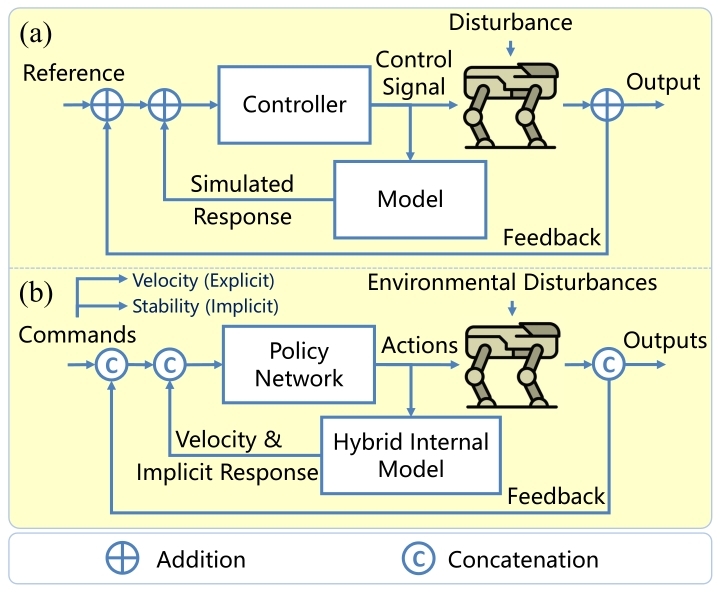

# 控制理论基本概念

## 系统表达形式

1. 状态空间形式（时域）

状态方程 ẋ = Ax + Bu
输出方程 y = Cx + Du


```text
                                      
r(t) 期望       e(t)             u(t) 
---->( O )------> [ C(s) ] ------> [ P(s) ] ------+----> y(t) 实际
     - ^                                          |
       |                                          |
       +------------------------------------------+

```
注意⚠️：控制器的输入不一定是 r(t) - y(t), 这只是其中一种形式。

- **信号定义**：
  - `r(t)` (Reference): 期望/参考信号
  - `y(t)` (Output): 系统实际状态/输出
  - `e(t)` (Error): 误差信号，`e(t) = r(t) - y(t)`
  - `u(t)` (Control Input): 控制器的输出，被控系统的控制输入，`u(t) = C(s)e(t)`

- **模块定义** (s 域传递函数)：
  - `C(s)` (Controller): 控制器（如 PID 算法）
  - `P(s)` (Plant/Process): 被控对象/系统


2. 高阶微分方程（时域）

3. 拉普拉斯变换形式（复频域）

4. 傅里叶变换形式（频域）


# Internal Model Principle

## 原型理论
[理论证明参考文章](https://zhuanlan.zhihu.com/p/131348966)

鲁棒性。即使被控系统的参数发生变化，或者外部信号的幅值、初值未知，只要控制器中包含正确的“内模”，系统就能自动调整，实现稳态误差为零。

被控对象  ẋ = Ax + Bu

参考信号模型 ẋᵣ = Aᵣ xᵣ

扰动模型 ẋ_d = A_d x_d

### 经典内模控制（IMC）框图

经典 IMC 框图包含三个核心部分：
- 实际被控对象 (Plant) $P$
- 内部模型 (Internal Model) $\tilde{P}$
- 控制器 (Controller) $C$

**工作原理：**
1. 控制输入 $u$ 同时作用于实际对象 $P$ 和内部模型 $\tilde{P}$。
2. 实际对象输出受扰动的状态 $y$（包含扰动 $d$）。
3. 内部模型输出理想的预测状态 $\tilde{y}$（不含扰动）。
4. 取两者差值 $e = y - \tilde{y}$，这个差值代表了**外部扰动与模型建模误差**的估计（即 $\hat{d}$）。
5. 该估计误差 $e$ 被反馈至输入端，控制器的实际输入为：`参考输入 r - 差值 e`。

```text
                                              d(t) 扰动
                                                 |
r(t) 期望     e_c(t)       u(t)                  v +            y(t) 实际
---->( O )------>[ C(s) ]---+--------->[ P(s) ]-->( O )---------+---->
     - ^                    |                                   |
       |                    |                                   |
       |                    +--------->[ P̃(s) ]-----+           |
       |                                            | ỹ(t)      |
       | d_hat(t) 扰动/误差估计                     v -         |
       +------------------------------------------( O )<--------+
                                                    ^ +

说明：
- ( O ) 表示求和点，箭头旁的 + / - 表示该信号是相加还是相减。
- d_hat(t) = y(t) - ỹ(t)
- e_c(t) 作为控制器的实际输入：e_c(t) = r(t) - d_hat(t) = r(t) - y(t) + ỹ(t)

**设计逻辑与控制目标：**
1. **为什么这么设计（剥离扰动）？** 
   传统的负反馈 `e = r - y` 无论是因为“系统还没反应过来”还是“有外力干扰”，都会产生误差，导致控制器盲目发力。
   而 IMC 的设计中，如果模型完美且无扰动，实际输出 `y` 和预测 `ỹ` 完全一致，此时反馈 `d_hat = 0`，系统相当于**开环控制**（`e_c = r`），开环非常稳定且极快！只有当**真实扰动**发生时，`d_hat` 才会有值。此时控制器的输入 `e_c = r - d_hat` 相当于告诉控制器：“我要跟踪参考 `r`，但我发现了意外扰动 `d_hat`，请你在发力时额外把这个扰动抵消掉！”
2. **e_c(t) 的控制目标不是趋于 0**：
   传统控制的目标是把误差 `e` 压到 0。但在 IMC 里，闭环的终极物理目标始终是 **`y(t) → r(t)`**（实际输出跟踪参考输入）。
   如果存在一个恒定扰动 `d`，系统稳定后 `y = r`，此时 `d_hat = d`，那么 `e_c(t)` 会稳定在 `r - d`。所以 `e_c(t)` 是一个**“被扰动修正后的期望信号”**，它不是用来清零的，而是用来驱动名义系统 `P̃` 产生出能刚好抵消扰动的控制力的。
```


## Hybrid Internal Model
https://arxiv.org/pdf/2312.11460


### 混合优化（Hybrid）:

显式量（线速度 $\hat{v}t$）：对于速度这种明确且关键的物理量，在仿真器里有绝对的真值（ground truth），那就直接用监督学习（回归）去拟合它。

隐式量（环境响应 $\hat{l}t$）：对于地形、摩擦力、受力这些难以精确定义的量，作者把它压缩成一个 16 维的隐变量（latent variable）。对这个隐变量，不用真值回归，而是用对比学习（Contrastive Learning）去优化它，让它“从概念上接近下一步的状态”。

### SwAV 对比学习机制 (Swapping Assignments)


HIM 放弃了传统IMC的直接让“历史”预测“未来”的精确物理数值（如具体的关节角），而是让它们在**抽象的模式（聚类）上保持一致**。

- **Source (源)** = 历史观测序列 $o_{t-H:t}$
- **Target (目标)** = 紧接着的下一步观测 $o_{t+1}$


#### 核心网络组件：

- **Source 网络** (代码称 `self.encoder`)：
  - **输入**：一段历史观测序列 `obs_history`
  - **输出**：预测的线速度（3维） + 历史的潜变量 $l^{source}$（16维）
  - **结构**：多层 MLP（隐藏层维度 `[128, 64, 16]`）

- **Target 网络** (代码称 `self.target`)：
  - **输入**：下一步单帧观测 `next_obs`
  - **输出**：未来的潜变量 $l^{target}$（16维）
  - **结构**：多层 MLP（隐藏层维度 `[128, 64]`）


#### 具体工作流程：

1. **特征提取 (Feature Extraction)**：
   使用网络将 Source 和 Target 分别压缩成 16 维的潜向量 $l^{source}$ 和 $l^{target}$，并做 L2 标准化，使其映射到高维空间的单位球面上。

2. **计算原型聚类概率 (Cluster Assignment)**：
   - **什么是原型向量 (Prototypes)？** 假设潜空间里有 $K$ 个可学习的向量（代码中的 `self.proto`）。它们可以被理解为**“典型的环境或运动模式模板”**（例如：模式A=走平地、模式B=上台阶、模式C=打滑等）。
     *(注：这些原型向量并非固定不变，在反向传播时，它们的数值也会根据 Loss 进行梯度更新，从而越来越准确地代表真实的典型模式。)*
   - **计算概率**：分别计算 $l^{source}$ 和 $l^{target}$ 与这 $K$ 个原型向量的相似度（内积），然后通过 Softmax 得到它们属于各个典型模式的概率分布 $p^{source}$ 和 $p^{target}$（这可以理解为网络根据当前特征做出的“软分类预测”）。

3. **防作弊机制 (Sinkhorn-Knopp 算法)**：
   为了防止网络“偷懒”（例如把所有状态都预测成同一种模式，导致 Loss 极低但未学到任何有用的特征），引入 Sinkhorn-Knopp 算法。该算法结合整个 Batch 的数据，强制给出一个更严格、更均匀的“权威目标分布” $q^{source}$ 和 $q^{target}$。相当于将整个batch的数据尽可能均匀地分配到这$K$个原型向量的模式中，在这个大前提下，再根据batch中每个样本各自的相似度去微调分配。

4. **交叉预测 (Swapping Assignments, 对应公式2)**：

   Swap Loss ： swap_loss = -0.5 * (q_s * log_p_t + q_t * log_p_s).mean()
   注：q_s代表q^{source}，p_t代表p^{target}，q_t代表q^{target}，p_s代表p^{source}。
   
   通常思路可能是用预测的 $p^{source}$ 去拟合目标的 $q^{source}$。但这里采用的是**交叉**：
   - 强制让**基于历史的预测** $p^{source}$，去拟合**属于未来的权威定性** $q^{target}$。
   - 强制让**基于未来的预测** $p^{target}$，去拟合**属于历史的权威定性** $q^{source}$。
   **为什么要交叉？** 因为历史和未来属于同一条时间线。通过让“历史”预测“未来”的模式，强迫网络不仅要记住当前的画面，更要挖掘出**跨越时间不变的本质规律**。从而使学到的潜变量（Latent）具备了预测未来和感知外部环境的能力。
   **两个网络的输出对应的时刻不同，为什么可以互相拟合，即让q_s和p_t的分布接近和让p_s和q_t的分布？** 因为机器人在运动中的物理连续性和环境变量的迟滞性。


问题2： 如何证明HIM的引入是有作用的


## Perceptive Internal Model
https://arxiv.org/pdf/2411.14386

问题1： 如何证明PIM的引入是有作用的，没有对比实验？


# H-infinity/H无穷控制理论

https://arxiv.org/pdf/2404.14405

# 柔顺控制

[Dobot 笛卡尔柔顺控制器设计原理](https://github.com/GuangjunZeng/dynamic_rotation/blob/main/serl/serl_dobot/impedance_controller.md)

# MPC

注： zhongyu有一篇人形结合MPC的文章


